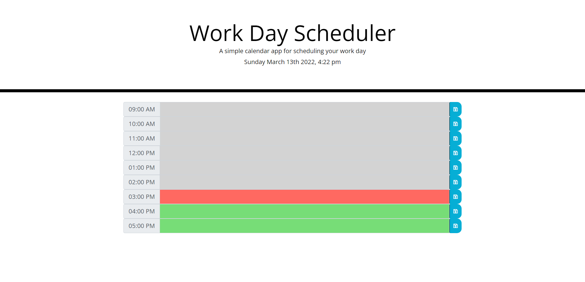

# Work Day Scheduler

* ['Work Day Scheduler GitHub'](https://github.com/asidiki/Workday-Scheduler)
* ['Work Day Scheduler GitHub IO'](https://asidiki.github.io/Workday-Scheduler/)

### Summary
* HTML and CSS and Javascript documents create a day planner with an eight-hour work day. This project leverages localStroage to save tasks entered by the user.

### Author
* Ansab Sidiki

